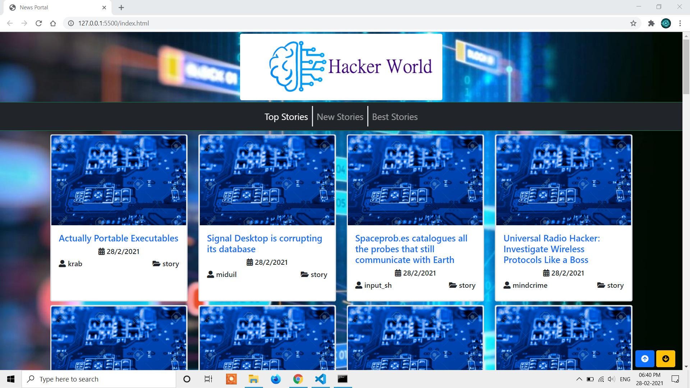
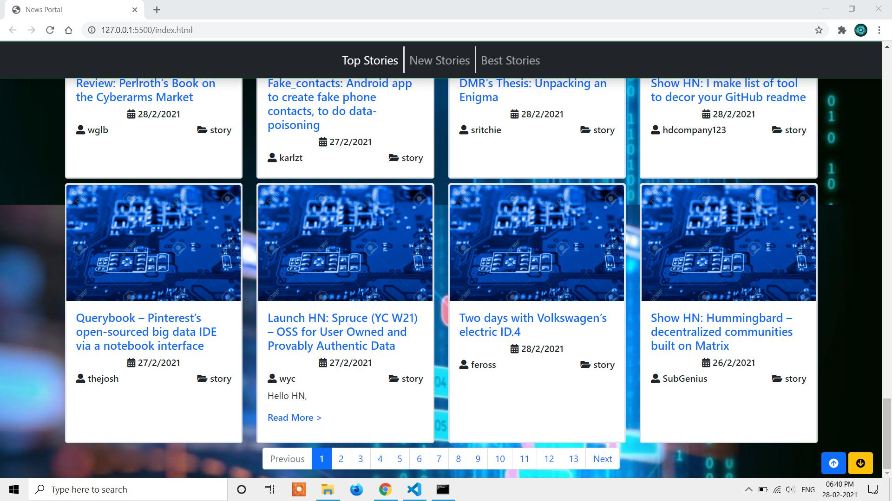
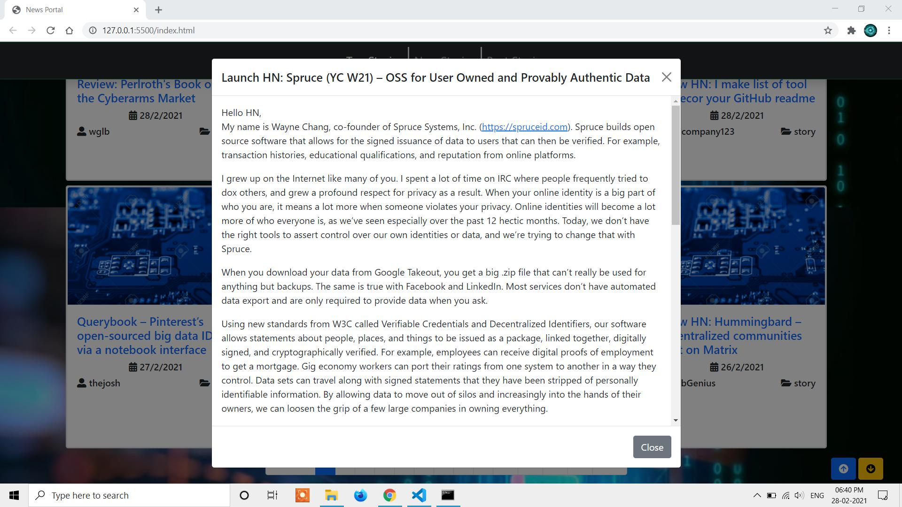
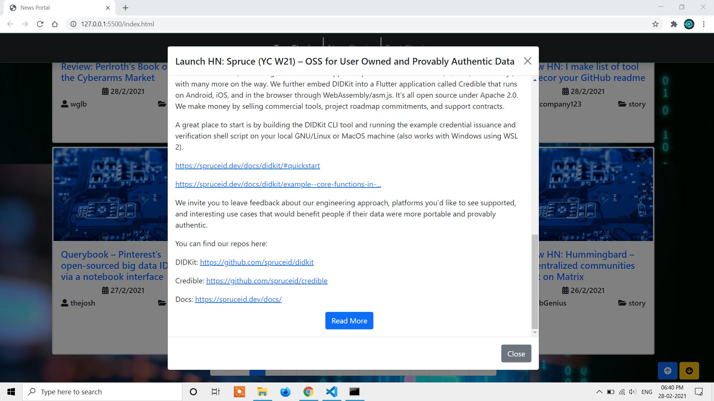

# This is a Tech News App developed using Express JS and HTML, CSS, Bootstrap5 & JS by the help of Hacker News API.
# Author: Dwaipayan Sardar ( dsardar099@gmail.com )
# These are some screenshots of the functionalities of this app.
##  Main UI

-------------------------------------------------------------------------------------
##  Pagination Facility & Page UP-DOWN Navigation Facility

-------------------------------------------------------------------------------------
##  Read More Modal

-------------------------------------------------------------------------------------
##  Redirect to Original Source Link in Read More Modal

-------------------------------------------------------------------------------------
# Instructions to run these.
-------------------------------------------------------------------------------------
## For starting express server
### Step-1: Go to Service folder 
### Step-2: To install all project dependencies execute
```
npm install
``` 
### Step-3: Now run using
```
nodemon app.js
``` 
-------------------------------------------------------------------------------------
## For running UI 
### Step-1: Go to Template folder 
### Step-2: Run using any http server or using live server extenion in VS CODE  

-------------------------------------------------------------------------------------
